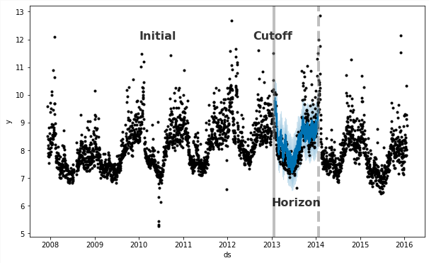

# Prophet
<br>
[**Prophet**](https://facebook.github.io/prophet/) es un modelo que trabaja con series de tiempo basado en un modelo aditivo presentado por Harvey & Peters 1990. EL modelo tiene tres componentes principales que son la tendencia, estacionalidad y feriados, los cuales se combinan con la siguiente formula:

<center>
$y(t) = g(t) + s(t) + h(t) + \epsilon_t$
</center>
<br>
En donde $g(t)$ es la funcion de tendencia, $s(t)$ representa los cambios periodicos y $h(t)$ representa el efecto de feriados donde potencialmente podriamos tener cierta distorcion en los valores.
Ademas, se agrega el termino $\epsilon_t$ que es el error, y representa cualquier cambio que no se ajustado por el modelo (se asume que esta normalmente distribuido).
<br>
Esta herramienta es opensource y está desarrollada por la compañia Meta, anteriormente conocida como Facebook.
<br>
```{r, warning=F, message=FALSE, echo=FALSE}
library(tidyverse)
library(tidymodels)
library(rsample)
library(ggplot2)
library(GGally)
library(corrr)
library(MASS)
library(data.table)
library(stringr)
library(prophet)
```

```{r theme general, echo=FALSE}

theme <- theme(text = element_text(size=10),
               plot.title = element_text(size = 12, face = "bold.italic", hjust = 0.5), 
               axis.title.x = element_text(size = 10, face="bold", colour='black'),         
               axis.title.y = element_text(size = 10, face="bold"),
               panel.border = element_blank(),
               panel.grid.major = element_blank(),
               panel.grid.minor = element_blank(), 
               legend.title = element_text(face="bold"))
```

## Dataset
```{r, echo=FALSE}
# Cargo los datasets
dataset_2019 = fread('./dataset/flujo-vehicular-por-radares-2019.csv', sep=',')
dataset_2020 = fread('./dataset/flujo-vehicular-por-radares-2020.csv', sep=',')
dataset_2021 = fread('./dataset/flujo-vehicular-por-radares-2021.csv', sep=',')
dataset_2022 = fread('./dataset/flujo-vehicular-por-radares-2022.csv', sep=';')

```

```{r, echo=FALSE}
# Ajusto el nombre de las columnas
colnames(dataset_2021) <- c("fecha","hora","autopista_nombre","disp_nombre","disp_ubicacion","seccion_sentido","lat","long","cantidad","hora_diciembre")
colnames(dataset_2022) <- c("fecha","hora","autopista_nombre","disp_nombre","disp_ubicacion","seccion_sentido","lat","long","cantidad")

# Genero una variable de tipo datetime
dataset_2019[ , fecha_hora := as.POSIXct(paste(fecha, hora), format="%Y-%m-%d %H") ]

# A partir de Octubre cambió el formato de fecha y està separado por '/' en lugar de '-'
# junio tiene como año 2019 en lugar de 2020
# agosto agrega la hora en el campo fecha, pero sin valor siempre 00:00:00
# octubre el separador es '/'
# noviembre y diciembre el formato de fecha cambió yy-mm-dd
dataset_2020[ , fecha_hora := as.POSIXct(paste(fecha, hora), format="%Y-%m-%d %H") ]
dataset_2020[ str_split(fecha, "-", simplify = TRUE)[,2] == "06" , fecha_hora := as.POSIXct(paste(str_replace(fecha, "2019", "2020"), hora), format="%Y-%m-%d %H")]
dataset_2020[ str_split(fecha, "-", simplify = TRUE)[,2] == "08" , fecha_hora := as.POSIXct(paste(str_replace(fecha, " 00:00:00", ""), hora), format="%Y-%m-%d %H")]
dataset_2020[ str_split(fecha, "/", simplify = TRUE)[,2] == "10" , fecha_hora := as.POSIXct(paste(fecha, hora), format="%Y/%m/%d %H")]
dataset_2020[ str_split(fecha, "-", simplify = TRUE)[,2] == "11" , fecha_hora := as.POSIXct(paste(fecha, hora), format="%y-%m-%d %H")]
dataset_2020[ str_split(fecha, "-", simplify = TRUE)[,2] == "12" , fecha_hora := as.POSIXct(paste(fecha, hora), format="%y-%m-%d %H")]

# En 2021 el formato de fecha cambió a dd/mm/yy
# En noviembre el formato de la fecha cambio a dd/mm/yyyy
# En diciembre 2021 se empezó a utilizar otro campo, el cual denominamos hora_diciembre
dataset_2021[ , fecha_hora := as.POSIXct(paste(fecha, hora), format="%d/%m/%y %H") ]
dataset_2021[ str_split(fecha, "/", simplify = TRUE)[,2] == "11" , fecha_hora := as.POSIXct(paste(fecha, hora), format="%d/%m/%Y %H")]
dataset_2021[ str_split(fecha, "/", simplify = TRUE)[,2] == "12" , fecha_hora := as.POSIXct(paste(fecha, hora_diciembre), format="%d/%m/%Y %H")]

# En 2022 la fecha volvió a cambiar a dd/mm/yy
dataset_2022[ , fecha_hora := as.POSIXct(paste(fecha, hora), format="%d/%m/%y %H") ]
```
### Entrenamiento y Prueba
```{r}
# Concateno los 3 datrbindlistaset de entrenamiento, me quedo solo con las columnas fecha_hora y cantidad.
dt_train <- rbindlist(
  list(
    dataset_2019[autopista_nombre == "AU 4  Lugones",.(total = sum(cantidad)), by = fecha_hora],
    dataset_2020[autopista_nombre == "AU 4  Lugones",.(total = sum(cantidad)), by = fecha_hora],
    dataset_2021[autopista_nombre == "AU 4  Lugones",.(total = sum(cantidad)), by = fecha_hora]
    )
  )

# ordeno por fecha
dt_train <- dt_train[order(fecha_hora)]

dt_test <- dataset_2022[autopista_nombre == "AU 4  Lugones",.(total = sum(cantidad)), by = fecha_hora]

# Prophet requiere que el campo fecha tenga el nombre "ds" y la cantidad el nombre "y"
colnames(dt_train) <- c("ds","y")
colnames(dt_test) <- c("ds","y")
```

```{r}
# Genero un resumen de los datos de entrenamiento
summary(dt_train)
```
## Modelos
<br>
Prophet contiene una serie de hiperparametros que sirven para controlar el **overfiting** en los tres componentes (tendencia, estacionalidad y holiday):
<br>
<br>
<ul>
  <li>**changepoint_prior_scale**: Determina la flexibilidad de la tendencia, sobre todo cuanto cambia en los puntos de quiebre de las mismas. Este parametro se puede setear en el rango de [0.001, 0.5], cuanto mas se acerque el valor a 0.001  va a tender a generar ruidos y underfiting; cuanto mas se acerque al 0.5 mayor overfiting vamos a tener y en el peor de los casos podria capturar la estacionalidad anual.</li>
  <br>
  <li>**seasonality_prior_scale**: Determina la flexibilidad que va a tener la estacionalidad, un rango razonable para este parametro es de  [0.01, 10] y sigue los mismos criterios de underfiting y overfiting que el changepoint_prior_scale.</li>
  <br>
  <li>**holidays_prior_scale**: Determina la flexibilidad del holiday, al igual que seasonality_prior_scale el rango razonable es de [0.01, 10] y sigue los criterios de under y overfitting.</li>
  <br>
  <li>**seasonality_mode**: se puede configurar como ['additive', 'multiplicative'], siendo additive el valor por defecto y el cual aplica en la mayoria de los casos de negocio. el multiplicative es recomendado en series de tiempo donde el efecto de la estacionalidad genere grandes fluctuaciones en el valor a predecir.</li>
</ul>
<br>

### Modelo inicial
<br>
Para el modelo inicial vamos a tomar el dataset de entrenamiento unicamente y modificaremos el hiperparametro changepoint.prior.scale a 0.01 para regularizar los efectos del cambio de tendencia ya que en los datos del 2020 tenemos el efecto de la pandemia. 
<br>
```{r}
# inicializamos prophet
modelo_inicial <- prophet(dt_train, changepoint.prior.scale=0.01)

```
<br>
Un vez que tenemos el modelo entrenado, corremos la predicción para datos del futuro y generamos el grafico que nos muestra la tendencia.
<br>
```{r}
# establecemos el rango de dias a predecir
future <- make_future_dataframe(modelo_inicial, periods = 1400, freq = 60 * 60)

# generamos la predicción
forecast_inicial <- predict(modelo_inicial, future)

# graficamos el modelo y la tendencia en el futuro
plot(modelo_inicial, forecast_inicial)

```
<br>
Podemos apreciar como el efecto de la pandemia genera una baja en la tendencia sobre el año 2020 y luego vuelve a retomar la tendencia previa a la pandemia.

Ahora generamos el grafico de los componentes tendencia, estacionalidad y holiday:
<br>

```{r}
# grafico de componentes
prophet_plot_components(modelo_inicial, forecast_inicial)

```
<br>
En este grafico se ve mejor el efecto de la pandemia sobre la tendencia, y tambien podemos ver la estacionalidad que existe a nivel semanal y horario en la serie de tiempo. Recordemos que no utilizamos el componente de holiday para este modelo, por ese motivo solo aparece la tendencia y estacionalidad.
<br>

### Sin pandemia y cuarentena

<br>
Como se vio en los graficos anteriores los efectos de la pandemia generaron una especie de ruido en la tendencia, por lo cual vamos a agregar el componente holiday al modelo, pasandole los dias en donde las restricciones de transito fueron mas fuertes en la ciudad de buenos aires.
<br>
```{r}
# cargo la tabla con los datos
lockdowns = fread('./dataset/lockdowns.csv', sep=',')

lockdowns
```
<br>
En este caso, asumimos que los efectos de la pandemia no van a generar ruido en la tendencia, por lo que el changepoint.prior.scale lo vamos a dejar en el valor por defecto (0.05)
<br>
```{r}

m_pandemia <- prophet(dt_train, holidays=lockdowns)

```
<br>
Nuevamente genero el grafico con la tendencia.
<br>
```{r}
# establecemos el rango de dias a predecir
future2 <- make_future_dataframe(m_pandemia, periods = 1400, freq = 60 * 60)

forecast_pandemia <- predict(m_pandemia, future2)

plot(m_pandemia, forecast_pandemia)
```
<br>
Vemos como al agregar el componente de holiday sobre los dias de la pandemia, la tendencia no se ve tan afectada por la misma. ademas vemos que al aumentar el changepoint.prior.scale, a simple vista el prophet con el rango de la pandemia en holiday pareciera funcionar mejor que sin el mismo.

Grafico los componentes
<br>
```{r}
prophet_plot_components(m_pandemia, forecast_pandemia)

```
<br>
Al igual que en el modelo inicial vemos como la pandemia afecta a la tendencia, pero en este caso en menor medida, ademas se agrega un quinto grafico con la tendencia en los dias establecidos como holiday. Tambien vemos que se mantienen los criterios de estacionalidad semanal y diaria.
<br>

## Evaluacion de modelos

<br>
La evaluacion de los modelos la vamos a realizar a partir de la funcion `cross_validation` que nos permite realizar pronósticos realizando un esquema de cross-validation temporal y, a partir de ellos, obtener ciertas métricas de performance.

  * **horizon**: horizonte del pronóstico. Cuánto tiempo deseo predecir
  
  * **period**: período entre fechas de análisis. Cuánto voy corriendo mi ventana
  
  * **initial**: período inicial de entrenamiento
   
  * **units**: unidad de tiempo utilizada 
   

<br>
*Grafico y descripcion obtenidos de* [*https://eea-uba.github.io/EEA-2022*](https://eea-uba.github.io/EEA-2022/clase%2011/prophet_shopping.nb.html#Evaluaci%C3%B3n_del_modelo)

### Modelo inicial

<br>
Vamos a realizar la validacion con una ventana inicial de 720 horas (30 dias), un horizonte de 360 horas (15 dias) y moveremos las ventanas en 168 horas (7 dias).
<br>
```{r}
cv_incial = cross_validation(modelo_inicial, initial = 720, period = 168, horizon = 360, units = 'hours')

cv_incial 
```


```{r}
metricas <- performance_metrics(cv_incial, rolling_window = 0.25) 
metricas
```


### Modelo sin Pandemia

<br>
Al igual que en el modelo incial vamos a realizar la validacion con una ventana inicial de 720 horas (30 dias), un horizonte de 360 horas (15 dias) y moveremos las ventanas en 168 horas (7 dias).
<br>
```{r}
cv_pandemia = cross_validation(m_pandemia, initial = 720, period = 168, horizon = 360, units = 'hours')

cv_pandemia 
```


```{r}
metricas <- performance_metrics(cv_pandemia, rolling_window = 0.25) 
metricas
```

Para poder comparar mejor las metricas vamos a generar un grafico con el MAE y RMSE de ambos modelos.

```{r}
mae_inicial = plot_cross_validation_metric(cv_incial, metric = 'mae', rolling_window = 0.25) + 
            theme_bw() + labs(title="Modelo Inicial: MAE")
rmse_inicial = plot_cross_validation_metric(cv_incial, metric = 'rmse', rolling_window = 0.25) + 
            theme_bw() + labs(title="Modelo Inicial: RMSE")

mae_pandemia = plot_cross_validation_metric(cv_pandemia, metric = 'mae', rolling_window = 0.25) + 
            theme_bw() + labs(title="Modelo pandemia: MAE")
rmse_pandemia = plot_cross_validation_metric(cv_pandemia, metric = 'rmse', rolling_window = 0.25) + 
            theme_bw() + labs(title="Modelo pandemia: RMSE")

cowplot::plot_grid(mae_inicial, rmse_inicial, mae_pandemia, rmse_pandemia)

```

```{r}
resultados_inicial <- data.table(forecast_inicial[c(1,22)])


prediccion_inicial <- merge(resultados_inicial,dt_test,by="ds")

```

```{r}
resultados_pandemia <- data.table(forecast_pandemia[c(1,31)])


prediccion_pandemia <- merge(resultados_pandemia,dt_test,by="ds")

```

```{r}
metrics(data = prediccion_inicial, truth = y, estimate = yhat) %>% mutate(.estimate = round(.estimate, 4))
metrics(data = prediccion_pandemia, truth = y, estimate = yhat) %>% mutate(.estimate = round(.estimate, 4))
```

Referencias:

https://facebook.github.io/prophet/
https://facebook.github.io/prophet/docs/quick_start.html


```{r}
```
